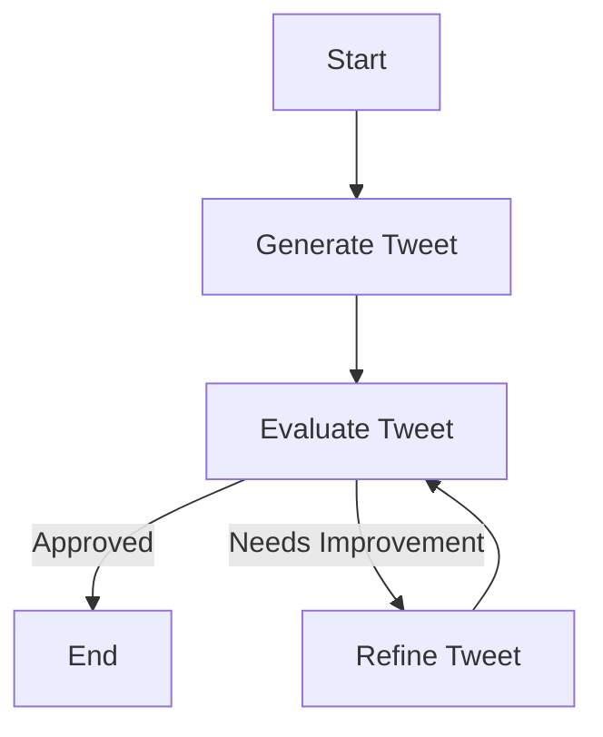
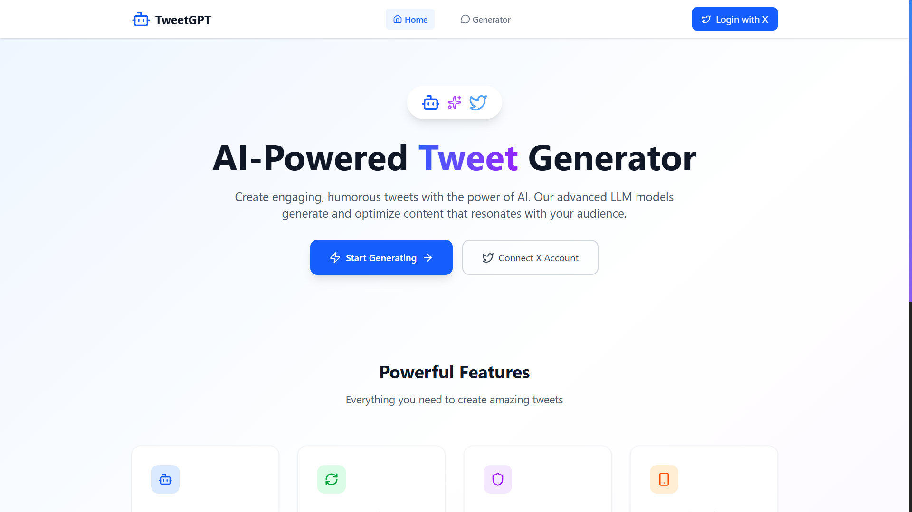
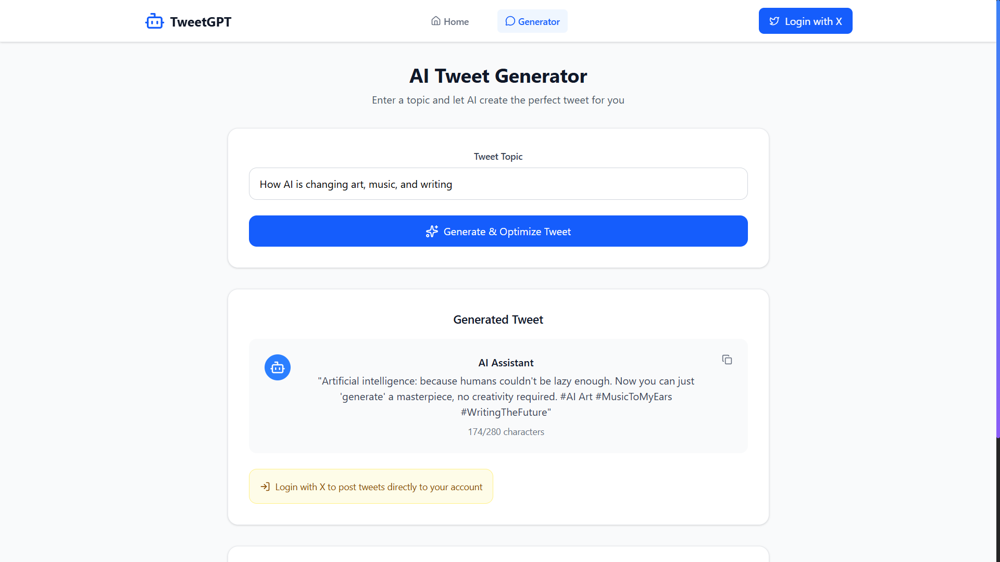
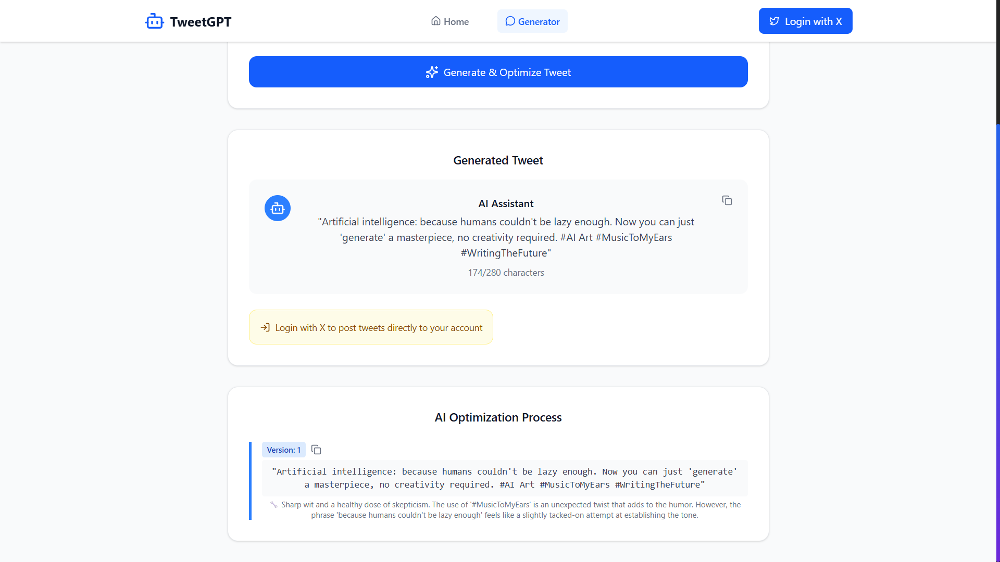

# 🐦 TweetGPT — AI-Powered Tweet Generator

**TweetGPT** is a modern, full-stack application that uses **Groq** or **Ollama** LLM models to generate, evaluate, and refine tweets automatically — with no manual intervention. It integrates with **X (Twitter) OAuth** for secure login and posting, features a sleek, mobile-friendly UI built with **React + Vite**, and deploys via **Docker** with **Nginx** for production-ready frontend hosting.

📦 **GitHub Repo:** [https://github.com/ArchitJ6/TweetGPT](https://github.com/ArchitJ6/TweetGPT)

---

## ✨ Features

* 🤖 **AI-Powered Tweet Generation** — Generates witty, snappy tweets using Groq or Ollama.
* 🔄 **Iterative Optimization** — Auto-refines tweets until quality and engagement criteria are met.
* 🔐 **X OAuth Integration** — Secure sign-in and direct posting to X.
* 🎯 **Automatic Evaluation** — AI checks humor, originality, brevity, and style without manual review.
* ⚡ **Fast Model Switching** — Toggle between Groq and Ollama seamlessly.
* 🎨 **Modern UI** — Responsive, Twitter-inspired interface.
* 📱 **Mobile Friendly** — Optimized for all devices.
* 🐳 **Dockerized Deployment** — Backend, frontend, and Nginx all containerized.
* 🌐 **Nginx Hosting** — Production-grade static file serving.
* 📊 **Autonomous AI Workflow** — Fully automated generation–evaluation–refinement loop.

---

## 🛠 Tech Stack

| Layer               | Technology                           |
| ------------------- | ------------------------------------ |
| **Frontend**        | React, Vite, JavaScript, CSS         |
| **Backend**         | Python, Flask, LangChain, LangGraph  |
| **AI Models**       | Groq LLM, Ollama LLM                 |
| **Auth**            | X (Twitter) OAuth 2.0                |
| **Deployment**      | Docker, Docker Compose, Nginx        |
| **Version Control** | Git, GitHub                          |

---

## ⚙️ Prerequisites

* 🐍 Python **3.12**
* 🐦 **X Developer Account** with API access
* 🔑 **Groq API Key**
* 💻 **Ollama** installed (if using Ollama mode)
* 🐳 **Docker** & **Docker Compose**

---

## 🧠 AI Workflow



**Steps:**

1. **Generate** → AI crafts a humorous tweet based on the topic.
2. **Evaluate** → AI reviews for creativity, humor, and shareability.
3. **Refine** → AI improves the tweet if it doesn’t pass.
4. **Loop** until approved or max iterations reached.

---

## 📂 Project Structure

```
TweetGPT/
├── backend/
│   ├── .env.example
│   ├── app.py
│   ├── config.py
│   ├── Dockerfile
│   ├── llm_workflow.py
│   └── requirements.txt
├── frontend/
│   ├── .env.example
│   ├── Dockerfile
│   ├── eslint.config.js
│   ├── index.html
│   ├── package-lock.json
│   ├── package.json
│   ├── vite.config.js
│   ├── public/
│   │   └── bot.svg
│   └── src/
│       ├── App.jsx
│       ├── index.css
│       ├── main.jsx
│       ├── components/
│       │   ├── index.js
│       │   ├── NavigationBar.jsx
│       │   └── NotificationBar.jsx
│       ├── pages/
│       │   ├── GeneratorPage.jsx
│       │   ├── HomePage.jsx
│       │   └── index.js
│       └── services/
│           ├── api.js
│           └── index.js
├── .dockerignore
├── .gitignore
└── docker-compose.yml
```

---

## 🚀 Setup & Run

### **1️⃣ Clone Repository**

```bash
git clone https://github.com/ArchitJ6/TweetGPT.git
cd TweetGPT
```

### **2️⃣ Configure Environment Variables**

📍 **Backend** (`backend/.env`)

```
cd backend
cp .env.example .env
```

```env
X_CLIENT_ID=""
X_CLIENT_SECRET=""
X_REDIRECT_URI="http://localhost:5000/callback"
X_AUTH_URL="https://twitter.com/i/oauth2/authorize"
X_TOKEN_URL="https://api.twitter.com/2/oauth2/token"
GROQ_API_KEY="your_groq_api_key"
USE_OLLAMA="true_or_false"
GROQ_LLM_MODEL_NAME="your_groq_llm_model_name"
OLLAMA_MODEL_NAME="your_ollama_model_name"
```

📍 **Frontend** (`frontend/.env`)

```
cd frontend
cp .env.example .env
```

```env
VITE_API_BASE_URL="http://localhost:5000"
```

### **3️⃣ Run Without Docker (Optional)**

🔹 **Backend**

```bash
cd backend
pip install -r requirements.txt
python app.py
```

🔹 **Frontend**

```bash
cd frontend
npm install
npm run dev
```

### **4️⃣ Run With Docker (Recommended)**

```bash
docker-compose up --build
```

Frontend will be served via **🌐 Nginx** at `http://localhost:5173` and backend will run at `http://localhost:5000`.

---

## 📸 Screenshots





---

## 📜 License

MIT License — free to use and modify.

---

## 🤝 Contributing

PRs welcome! Please follow the existing code style.

---

**Made with ❤️ by Archit Jain**
